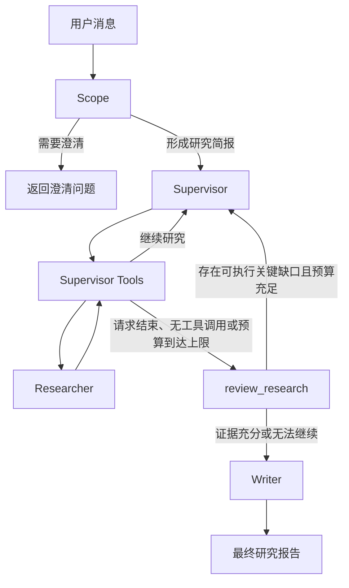

# Mini Research Agent

一个基于 LangGraph 的多阶段研究代理。系统会先澄清用户需求并生成研究简报，再由 Supervisor 拆分任务、调用研究员收集证据，随后通过 `review_research` 检查问题覆盖、证据支持和关键缺口，最后生成带来源说明的研究报告。

**当前版本以单项研究任务为入口**：支持需求澄清、多来源检索、证据评审、研究进度显示和报告生成。自由多轮对话、跨会话长期记忆、按需启动深度研究和后台研究属于后续规划，尚未实现。

## 已实现功能

- 根据对话判断是否需要用户补充信息。
- 将需求转换为结构化研究简报。
- 由 Supervisor 拆分并并发执行研究任务。
- 同时使用网页搜索、本地知识库和受控本地文件作为证据来源。
- 在结束研究前执行结构化证据评审。
- 评审发现可补充的关键缺口时，返回 Supervisor 定向补充研究。
- 预算耗尽或缺口无法补充时，将限制和未解决问题传给 Writer。
- 输出包含网页、知识库和本地文件引用的 Markdown 报告。
- 研究期间显示任务开始、完成、失败、工具调用和证据评审进度。
- 连续 10 秒没有新进度时显示当前阶段和等待时长。
- 研究正常结束、失败或取消后清理等待提示任务；并行研究失败时取消并等待尚未完成的兄弟任务。

## 工作流



`ResearchComplete` 表示“请求评审是否可以结束”，不会直接终止研究。`review_research` 使用结构化的 `ResearchReview` 结果进行路由：

- `sufficient` 且不存在关键缺口：结束研究并生成报告。
- 存在具体、可执行的关键补充任务，且仍有研究和评审预算：将反馈交回 Supervisor。
- 研究预算耗尽、评审轮次耗尽或缺口无法执行：结束研究，并在报告中保留证据限制。

默认 Supervisor 最多运行 6 次，评审最多运行 2 轮。可通过 `create_supervisor_graph()` 的 `max_researcher_iterations` 和 `max_review_rounds` 参数调整。

## 技术组成

- Python 3.11+
- LangGraph：工作流和状态管理
- LangChain：模型、消息与工具接口
- DeepSeek：Scope、Researcher、Supervisor、Reviewer 和 Writer 模型
- Tavily：网页搜索
- Chroma：本地向量索引
- Hugging Face Embeddings：本地知识库向量化
- Filesystem MCP：受限目录发现
- 自定义只读文件工具：按行读取本地证据

## 快速开始

### 1. 准备环境

需要安装：

- Python 3.11 或更高版本
- [uv](https://docs.astral.sh/uv/)
- Node.js/npm，用于执行 `npx @modelcontextprotocol/server-filesystem`

在项目目录中安装依赖：

```powershell
uv sync
```

### 2. 配置环境变量

复制示例配置：

```powershell
Copy-Item .env.example .env
```

至少填写：

```dotenv
DEEPSEEK_API_KEY=你的-DeepSeek-API-Key
TAVILY_API_KEY=你的-Tavily-API-Key
```

默认模型在 `src/mini_research_agent/config/models.py` 中配置，通过 OpenAI 兼容接口访问 DeepSeek。

### 3. 准备本地目录

```powershell
New-Item -ItemType Directory -Force files
New-Item -ItemType Directory -Force data/knowledge_base
```

- `files/`：供研究代理受控检索和按行读取的文件。
- `data/knowledge_base/`：需要建立向量索引的 Markdown 或文本资料。
- `data/vector_store/`：运行知识库入库后生成的 Chroma 索引。

### 4. 建立知识库索引

将 `.md` 或 `.txt` 文件放入 `data/knowledge_base/`，然后执行：

```powershell
uv run mini-research-ingest
```

命令会输出 JSON 格式的入库报告。首次运行默认嵌入模型时可能需要下载模型文件。

### 5. 启动研究代理

```powershell
uv run mini-research-agent
```

输入研究需求。如果问题不够明确，程序会返回澄清问题；补充信息后会继续使用同一个 `thread_id`。生成最终报告后，当前 CLI 进程结束。

`uv run` 会使用项目环境，无需手动激活 `.venv`。已有 `.env` 时保留原配置，不要重复复制覆盖。

示例输入：

```text
比较 2025 年三种主流向量数据库在混合检索、部署成本和 Python 生态方面的差异，关键结论必须附来源。
```

## 研究进度反馈

CLI 在每轮输入后立即显示“正在分析研究需求”，随后按真实执行事件输出进度。以下仅为显示示例，任务、工具名称和耗时以实际运行为准：

```text
[  0秒] 正在分析研究需求
[  3秒] 研究范围已确定，开始研究
[  5秒] 任务1：开始研究：方案的技术能力
[  5秒] 任务2：开始研究：方案的部署成本
[  8秒] 正在调用工具：search_knowledge_base
[ 18秒] 正在研究资料；最近 10 秒没有新进度
[ 21秒] 工具已返回：search_knowledge_base
[ 32秒] 任务1：研究完成
[ 40秒] 任务2：研究完成
[ 41秒] 开始检查证据是否充分
[ 46秒] 正在生成最终报告
```

实现分工：

| 位置 | 职责 |
| --- | --- |
| `cli.run_with_progress()` | 使用 `astream` 消费 `updates` 和 `custom` 事件，启用子图事件接收；结束后读取 checkpoint 完整状态 |
| `cli.log()` / `cli.heartbeat()` | `run_with_progress()` 内的局部函数，负责即时日志、经过时间和静默期间的等待提示 |
| `supervisor_tools()` / `run_research_task()` | 调度并行研究，发送带任务 ID 的生命周期事件，清理失败批次的未完成任务 |
| `review_research()` | 发送证据评审和定向补查事件 |
| `tool_node()` | 发送工具调用、返回和异常事件，保留原有工具错误恢复逻辑 |

等待提示按最近真实事件或上一次等待提示计算下次显示时间，不表示研究完成百分比，也不代表远端请求仍然健康。`Ctrl+C` 可以停止当前运行。

本版流式显示的是**研究进度**；报告正文仍在生成完成后一次性输出。工具事件目前显示工具名，尚未关联其所属研究任务编号。

## 证据来源

### 网页搜索

Researcher 使用 Tavily 搜索网页并保留来源 URL。网页正文会先压缩为摘要和关键摘录，再进入研究上下文。

### 本地知识库

知识库文件经过加载、分块和向量化后写入 Chroma。检索结果包含稳定的 Citation ID、源文件路径、章节和页码等可用元数据。

默认配置：

```dotenv
RAG_KNOWLEDGE_BASE_PATH=data/knowledge_base
RAG_VECTOR_STORE_PATH=data/vector_store
RAG_COLLECTION_NAME=mini_research_knowledge
RAG_EMBEDDING_PROVIDER=huggingface
RAG_EMBEDDING_MODEL=BAAI/bge-m3
RAG_EMBEDDING_DEVICE=cpu
RAG_CHUNK_SIZE=1000
RAG_CHUNK_OVERLAP=150
RAG_RETRIEVAL_TOP_K=5
RAG_SCORE_THRESHOLD=
RAG_SUPPORTED_EXTENSIONS=.md,.txt
RAG_INGESTION_BATCH_SIZE=32
```

### 本地文件

Filesystem MCP 只能发现 `MCP_FILES_ROOT` 内的文件。正文读取由 `inspect_file` 和 `read_file_range` 完成，并受到路径、扩展名、单次行数和输出字符数限制。路径越界、非 UTF-8 文本和未允许的扩展名会被拒绝。

默认配置：

```dotenv
MCP_FILES_ROOT=files
MCP_MAX_FULL_FILE_BYTES=100000
MCP_MAX_RANGE_LINES=300
MCP_MAX_OUTPUT_CHARACTERS=30000
MCP_ALLOWED_EXTENSIONS=.md,.txt,.py,.json,.yaml,.yml,.csv
```

## 报告引用格式

Writer 提示词要求只引用研究结果中已经出现的来源；这属于生成约束，不等同于程序化验证每条引用：

```text
网页来源：[1]
知识库来源：[KB:chunk-id]
本地文件来源：[FILE:path/to/file#L10-L40]
```

报告末尾会按实际使用情况生成 Web Sources、Knowledge Base Sources 和 MCP File Sources。

## 项目结构

```text
src/mini_research_agent/
├── bootstrap.py        # 装配模型、工具、RAG、MCP 和完整工作流
├── cli.py              # 研究输入、进度事件消费、等待提示和结果输出
├── config/             # 模型、RAG 和本地文件配置
├── graphs/
│   ├── scope.py        # 澄清需求并生成研究简报
│   ├── research.py     # 单个研究员的工具调用与结果压缩
│   ├── supervisor.py   # 任务调度、review_research 和结束路由
│   └── full_agent.py   # Scope → Supervisor → Writer 主流程
├── prompts/            # 各阶段提示词
├── rag/                # 文档加载、分块、入库、检索和工具
├── schemas/            # LangGraph 状态和结构化输出模型
├── scripts/ingest.py   # 知识库入库命令
├── tools/              # 网页搜索、思考、MCP 和受控文件读取
└── utils/              # 日期与路径工具
```

代码和测试使用分类包导入，例如 `mini_research_agent.graphs.full_agent`、`mini_research_agent.graphs.research`。不依赖重构前的旧模块路径。

`tests/test_progress.py` 验证嵌套进度、工具异常、并行任务、取消清理和等待计时。根目录的 [AI_CHANGELOG.md](AI_CHANGELOG.md) 记录实现变更与验证结果。

## 程序化使用

```python
import asyncio

from langchain_core.messages import HumanMessage
from langgraph.checkpoint.memory import InMemorySaver

from mini_research_agent.bootstrap import create_application


async def main() -> None:
    runtime = await create_application(
        checkpointer=InMemorySaver(),
    )

    result = await runtime.graph.ainvoke(
        {
            "messages": [
                HumanMessage(content="研究量化检索与混合检索的适用场景")
            ]
        },
        config={
            "configurable": {
                "thread_id": "example-session",
            }
        },
    )

    final_report = result.get("final_report")
    if final_report:
        print(final_report)
    else:
        messages = result.get("messages", [])
        if messages:
            print(messages[-1].content)


asyncio.run(main())
```

使用依赖注入时，可以分别传入研究模型、压缩模型、Supervisor 模型、Writer 模型、工具或子图，便于测试和替换实现。

上述 `ainvoke()` 示例等待完整结果，不显示过程。需要与 CLI 相同的进度输出时，导入 `mini_research_agent.cli.run_with_progress`，并用 `await run_with_progress(runtime.graph, inputs, config)` 执行；其中 `inputs` 和 `config` 与示例中的图输入及会话配置相同，图需配置 checkpointer。

## 测试

运行全部测试：

```powershell
uv run pytest -q
```

测试覆盖 Scope、Researcher、Supervisor、评审回流、Writer、RAG 入库和检索、MCP 文件读取、CLI 与完整应用装配，以及真实嵌套图的进度传递、并行任务生命周期、工具异常和等待提示清理。

2026-09-08 的进度功能验证结果为 **68 项测试通过**。测试使用替代模型和受控工具，不代表真实外部模型、搜索服务或网络连接已完成端到端验证。

## 当前限制

- CLI 使用 `InMemorySaver`，对话状态只在当前进程内保存，不属于跨进程长期记忆。
- CLI 使用固定的 `thread_id`，目前面向单个命令行研究会话。
- 生成报告后 CLI 退出，尚不支持自由连续对话或研究期间继续输入消息。
- 每项请求仍通过研究主流程，尚无普通聊天、轻量检索和深度研究的按需选择机制。
- 当前启动过程会初始化 RAG 和 MCP，尚未实现检索能力的按需初始化。
- 等待提示依赖可正常调度的 asyncio 事件循环，不能替代工具超时、服务健康检查或自动重试。
- 默认只支持 Hugging Face 嵌入模型。
- 本地知识库默认只索引 Markdown 和纯文本文件。
- 本地文件正文必须能够按 UTF-8 读取。
- 模型和搜索调用需要有效的 DeepSeek 与 Tavily API Key。

## 后续架构目标（尚未实现）

将项目演进为一个持续对话助手：普通问题直接回答，需要资料时查询本地知识库或外部信息，只有复杂任务或用户明确要求时才启动 Deep Research。

```text
用户输入 → 加载会话和相关记忆 → 对话 Agent
                              ├─ 信息足够 → 回答
                              ├─ 需要资料 → 本地/外部检索 → 回答
                              └─ 需要深入调查 → 研究条件与预算检查
                                                 ↓
                                           Deep Research
                                                 ↓
                                         摘要、来源和报告引用
                                                 ↓
                                          回到对话 → 下一轮
```

本地检索与外部查询可以在一轮中组合使用。对已有报告的总结和追问优先复用结果，不自动重新研究。一次检索无结果或工具失败不应单独成为升级深度研究的理由。

### 状态与记忆边界

| 数据层 | 保存内容 | 范围 |
| --- | --- | --- |
| 会话状态 | 用户与助手消息、会话摘要、待澄清事项、研究结果引用 | `conversation_id` |
| 本轮状态 | 当前请求、工具结果、工具预算和待回答内容 | `turn_id` |
| 研究任务状态 | 研究简报、子任务、证据、评审、限制和报告 | `research_id` |
| 长期记忆 | 用户明确偏好、项目事实与决策、历史任务摘要 | 按用户和项目隔离，可跨会话召回 |
| 本地知识库 | 原始文档、分块、索引及来源定位 | 按文档和访问范围检索 |

长期记忆与知识库分别管理。完整报告和原始研究资料单独保存，会话主要持有摘要和引用，避免旧研究状态污染新问题。

拟采用 LangGraph Checkpointer 保存可恢复的执行状态，LangGraph Store 管理跨会话记忆，并以 PostgreSQL 持久化；现有 Chroma 知识库继续复用。LangMem 在长期记忆阶段评估用于记忆提取和整理。**PostgreSQL 和 LangMem 当前均不是运行本项目所必需的依赖。**

### 分阶段实施路径

下表全部为待实施规划。新增模块名称是建议落点，当前目录中不一定存在。

| 顺序 | 模块与目标 | 主要改动 | 阶段验收 |
| --- | --- | --- | --- |
| 1 | 状态隔离与存储基础 | 定义会话、本轮、研究任务状态和所属用户；新增 `storage/`；接入持久化 checkpoint | 会话隔离、研究状态不串用、重启可恢复、报告可定位 |
| 2 | 持续对话主 Agent | 新增 `graphs/conversation.py`、对话提示词和 `memory/context_builder.py`；调整 CLI 入口 | 闲聊、追问、澄清和话题切换正常；回答流式输出；答完继续输入 |
| 3 | 轻量检索与证据管理 | 复用 RAG、网页和文件工具；统一证据对象；新增工具预算与错误处理；资源按需初始化 | 本地与外部资料可组合回答并附来源；简单检索不进入研究流程 |
| 4 | 长期记忆 | 新增记忆存取、召回、提取、更新和删除；先支持明确事实与纠错，再评估自动整理 | 跨会话找回项目约束、纠正旧事实、过滤无关记忆、支持查看与删除 |
| 5 | 按需深度研究 | 新增研究策略与服务；将现有研究图封装成独立任务；传入已有证据和预算 | 复杂问题按规则启动研究；报告追问复用结果；任务状态与预算独立 |
| 6 | 后台任务与统一事件 | 新增任务管理和事件协议；解耦输入与研究执行；关联会话、轮次、研究和子任务 ID | 研究时可继续交流、查看进度和取消；结果归入正确会话 |
| 7 | 全链路评估与稳定性 | 建立固定场景集和观测指标，补充跨模块回归 | 验证路由选择、引用、记忆更新、预算、失败恢复与首条反馈时间 |

每个阶段都先补充对应测试再完成实现，第 7 阶段集中验证跨模块行为。近期实施顺序为 **状态隔离与存储基础 → 持续对话主 Agent → 轻量检索**；后续再接入长期记忆、按需研究和后台运行。
