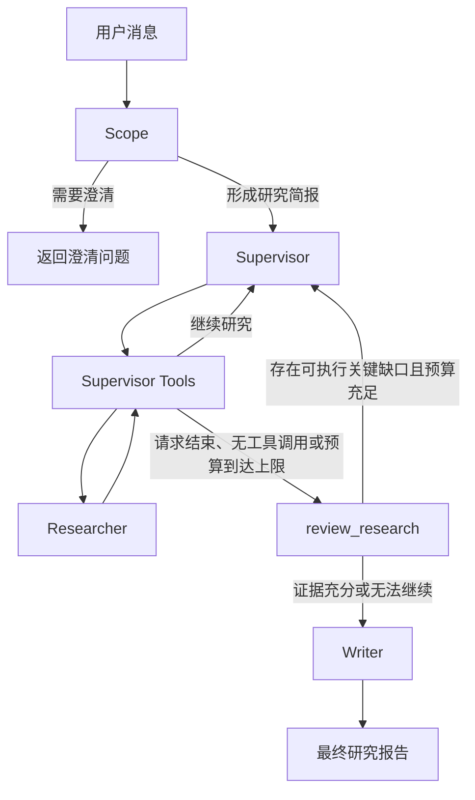

# Mini Research Agent

一个基于 LangGraph 的多阶段研究代理。系统会先澄清用户需求并生成研究简报，再由 Supervisor 拆分任务、调用研究员收集证据，随后通过 `review_research` 检查问题覆盖、证据支持和关键缺口，最后生成带来源说明的研究报告。

## 功能

- 根据对话判断是否需要用户补充信息。
- 将需求转换为结构化研究简报。
- 由 Supervisor 拆分并并发执行研究任务。
- 同时使用网页搜索、本地知识库和受控本地文件作为证据来源。
- 在结束研究前执行结构化证据评审。
- 评审发现可补充的关键缺口时，返回 Supervisor 定向补充研究。
- 预算耗尽或缺口无法补充时，将限制和未解决问题传给 Writer。
- 输出包含网页、知识库和本地文件引用的 Markdown 报告。

## 工作流



`ResearchComplete` 表示“请求评审是否可以结束”，不会直接终止研究。`review_research` 使用结构化的 `ResearchReview` 结果进行路由：

- `sufficient` 且不存在关键缺口：结束研究并生成报告。
- 存在具体、可执行的关键补充任务，且仍有研究和评审预算：将反馈交回 Supervisor。
- 研究预算耗尽、评审轮次耗尽或缺口无法执行：结束研究，并在报告中保留证据限制。

默认 Supervisor 最多运行 6 次，评审最多运行 2 轮。可通过 `create_supervisor_graph()` 的 `max_researcher_iterations` 和 `max_review_rounds` 参数调整。

## 技术组成

- Python 3.11+
- LangGraph：工作流和状态管理
- LangChain：模型、消息与工具接口
- DeepSeek：Scope、Researcher、Supervisor、Reviewer 和 Writer 模型
- Tavily：网页搜索
- Chroma：本地向量索引
- Hugging Face Embeddings：本地知识库向量化
- Filesystem MCP：受限目录发现
- 自定义只读文件工具：按行读取本地证据

## 快速开始

### 1. 准备环境

需要安装：

- Python 3.11 或更高版本
- [uv](https://docs.astral.sh/uv/)
- Node.js/npm，用于执行 `npx @modelcontextprotocol/server-filesystem`

在项目目录中安装依赖：

```powershell
uv sync
```

### 2. 配置环境变量

复制示例配置：

```powershell
Copy-Item .env.example .env
```

至少填写：

```dotenv
DEEPSEEK_API_KEY=你的-DeepSeek-API-Key
TAVILY_API_KEY=你的-Tavily-API-Key
```

默认模型在 `src/mini_research_agent/config/models.py` 中配置，通过 OpenAI 兼容接口访问 DeepSeek。

### 3. 准备本地目录

```powershell
New-Item -ItemType Directory -Force files
New-Item -ItemType Directory -Force data/knowledge_base
```

- `files/`：供研究代理受控检索和按行读取的文件。
- `data/knowledge_base/`：需要建立向量索引的 Markdown 或文本资料。
- `data/vector_store/`：运行知识库入库后生成的 Chroma 索引。

### 4. 建立知识库索引

将 `.md` 或 `.txt` 文件放入 `data/knowledge_base/`，然后执行：

```powershell
uv run mini-research-ingest
```

命令会输出 JSON 格式的入库报告。首次运行默认嵌入模型时可能需要下载模型文件。

### 5. 启动研究代理

```powershell
uv run mini-research-agent
```

输入研究需求。如果问题不够明确，程序会返回澄清问题；补充信息后会继续使用同一个 `thread_id`。生成最终报告后，当前 CLI 进程结束。

示例输入：

```text
比较 2025 年三种主流向量数据库在混合检索、部署成本和 Python 生态方面的差异，关键结论必须附来源。
```

## 证据来源

### 网页搜索

Researcher 使用 Tavily 搜索网页并保留来源 URL。网页正文会先压缩为摘要和关键摘录，再进入研究上下文。

### 本地知识库

知识库文件经过加载、分块和向量化后写入 Chroma。检索结果包含稳定的 Citation ID、源文件路径、章节和页码等可用元数据。

默认配置：

```dotenv
RAG_KNOWLEDGE_BASE_PATH=data/knowledge_base
RAG_VECTOR_STORE_PATH=data/vector_store
RAG_COLLECTION_NAME=mini_research_knowledge
RAG_EMBEDDING_PROVIDER=huggingface
RAG_EMBEDDING_MODEL=BAAI/bge-m3
RAG_EMBEDDING_DEVICE=cpu
RAG_CHUNK_SIZE=1000
RAG_CHUNK_OVERLAP=150
RAG_RETRIEVAL_TOP_K=5
RAG_SCORE_THRESHOLD=
RAG_SUPPORTED_EXTENSIONS=.md,.txt
RAG_INGESTION_BATCH_SIZE=32
```

### 本地文件

Filesystem MCP 只能发现 `MCP_FILES_ROOT` 内的文件。正文读取由 `inspect_file` 和 `read_file_range` 完成，并受到路径、扩展名、单次行数和输出字符数限制。路径越界、非 UTF-8 文本和未允许的扩展名会被拒绝。

默认配置：

```dotenv
MCP_FILES_ROOT=files
MCP_MAX_FULL_FILE_BYTES=100000
MCP_MAX_RANGE_LINES=300
MCP_MAX_OUTPUT_CHARACTERS=30000
MCP_ALLOWED_EXTENSIONS=.md,.txt,.py,.json,.yaml,.yml,.csv
```

## 报告引用格式

Writer 只允许引用研究结果中已经出现的来源：

```text
网页来源：[1]
知识库来源：[KB:chunk-id]
本地文件来源：[FILE:path/to/file#L10-L40]
```

报告末尾会按实际使用情况生成 Web Sources、Knowledge Base Sources 和 MCP File Sources。

## 项目结构

```text
src/mini_research_agent/
├── bootstrap.py        # 装配模型、工具、RAG、MCP 和完整工作流
├── cli.py              # 命令行入口
├── config/             # 模型、RAG 和本地文件配置
├── graphs/
│   ├── scope.py        # 澄清需求并生成研究简报
│   ├── research.py     # 单个研究员的工具调用与结果压缩
│   ├── supervisor.py   # 任务调度、review_research 和结束路由
│   └── full_agent.py   # Scope → Supervisor → Writer 主流程
├── prompts/            # 各阶段提示词
├── rag/                # 文档加载、分块、入库、检索和工具
├── schemas/            # LangGraph 状态和结构化输出模型
├── scripts/ingest.py   # 知识库入库命令
├── tools/              # 网页搜索、思考、MCP 和受控文件读取
└── utils/              # 日期与路径工具
```

根目录中的 `app_graph.py`、`full_agent.py`、`research_graph.py` 等模块用于兼容旧导入路径。新代码应从 `mini_research_agent.graphs`、`schemas`、`tools` 等分类包导入。

## 程序化使用

```python
import asyncio

from langchain_core.messages import HumanMessage
from langgraph.checkpoint.memory import InMemorySaver

from mini_research_agent.bootstrap import create_application


async def main() -> None:
    runtime = await create_application(
        checkpointer=InMemorySaver(),
    )

    result = await runtime.graph.ainvoke(
        {
            "messages": [
                HumanMessage(content="研究量化检索与混合检索的适用场景")
            ]
        },
        config={
            "configurable": {
                "thread_id": "example-session",
            }
        },
    )

    print(result.get("final_report", result["messages"][-1].content))


asyncio.run(main())
```

使用依赖注入时，可以分别传入研究模型、压缩模型、Supervisor 模型、Writer 模型、工具或子图，便于测试和替换实现。

## 测试

运行全部测试：

```powershell
uv run pytest -q
```

测试覆盖 Scope、Researcher、Supervisor、评审回流、Writer、RAG 入库和检索、MCP 文件读取、CLI 与完整应用装配。

## 当前限制

- CLI 使用 `InMemorySaver`，对话状态只在当前进程内保存，不属于跨进程长期记忆。
- CLI 使用固定的 `thread_id`，目前面向单个命令行研究会话。
- 默认只支持 Hugging Face 嵌入模型。
- 本地知识库默认只索引 Markdown 和纯文本文件。
- 本地文件正文必须能够按 UTF-8 读取。
- 模型和搜索调用需要有效的 DeepSeek 与 Tavily API Key。
# mini_research_agent

